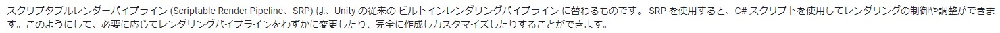
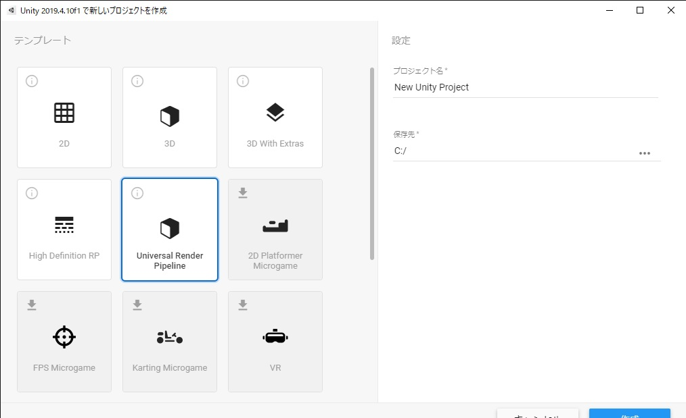
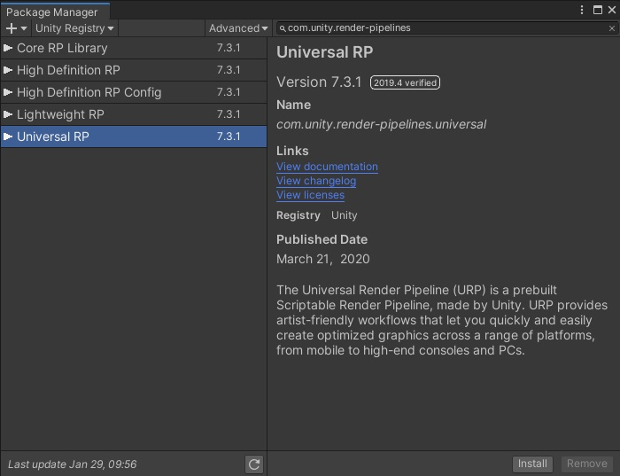
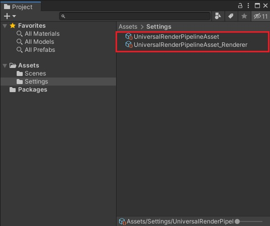
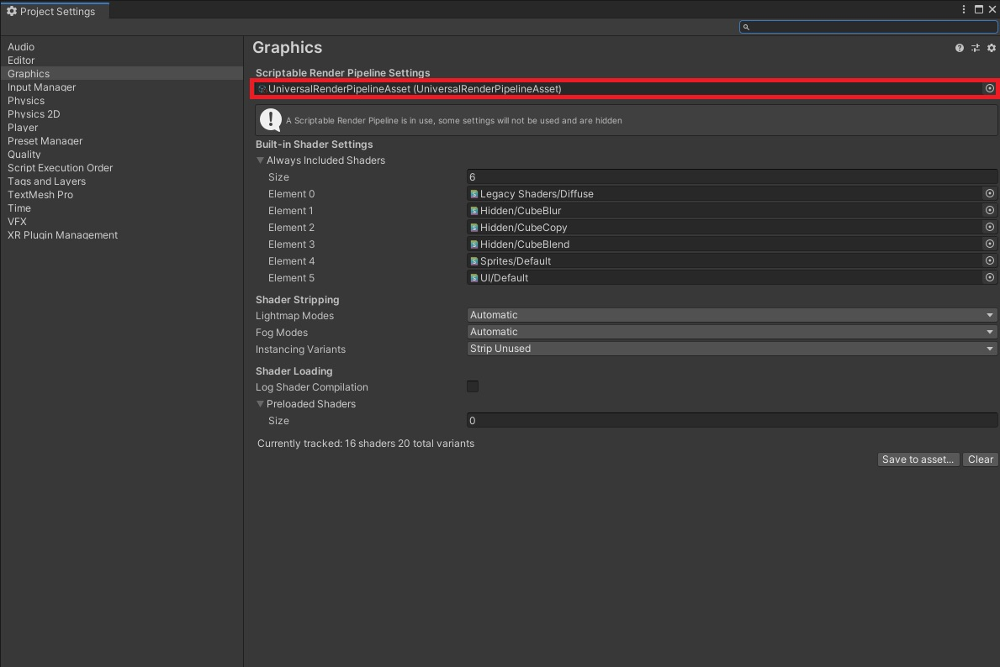
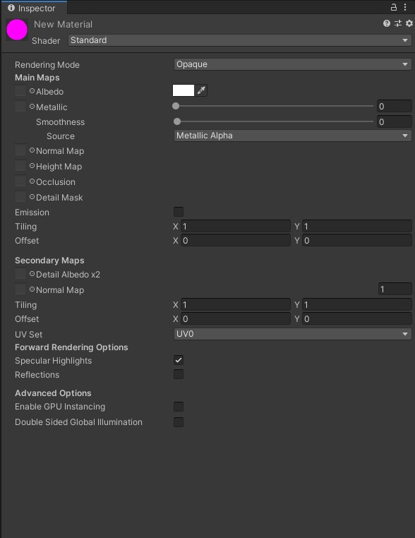
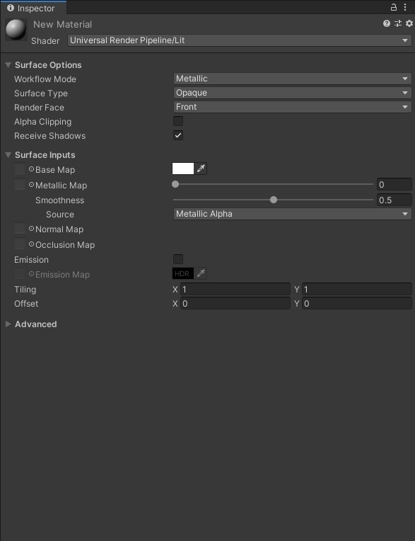

# URPを覚えよう ～特徴からプロジェクト作成まで～

この記事はURPを勉強し始めた筆者のメモ書きです

目次

はじめに

1. [Universal Render Pipline ( URP ) って何？](#001)
2. [レンダーパイプラインとは](#002)
3. [Scriptable Render Pipline ( SRP ) とURP](#003)
4. [URPの特徴](#004)
5. [まとめ](#005)

## はじめに
最近始動したプロジェクトでURPを使用することになりました。  
実は前々から興味はあれど手をつけずにいたので、この機会にちゃんと勉強します。  

## 1.Universal Render Pipline ( URP ) って何？
Universal Render Pipeline、通称URPは（長いのでURPで統一します）、Unity従来のレンダリングパイプラインである「Built-in」に変わる新しい機能として提供されているレンダリングパイプラインです。  
URPはオープンソースとなっており、現在も[GitHub](https://github.com/Unity-Technologies/Graphics)にて開発が進められています。

- UnityデフォルトのパイプラインであるBuilt-in Render Piplineの後継として採用されることが決まっている新しいレンダーパイプラインの事
- 今まではLighht Weight Render Pipline、通称LWRPとして配布されていたが、unity2018以降、URPに改名

## 2.レンダリングパイプラインとは
レンダリングパイプラインとは、ゲーム空間上に配置したオブジェクトが最終的に画面に表示されるまでに行われる作業の工程の事です。

この工程で行われる各処理の事をPASSといい、パイプラインに渡されてきたオブジェクトは各PASSを通り、最終的に画面上に絵として表示されます。

### PASSによって行われる処理の例
- カリング処理
- 陰影処理
- ラスタライズ
- ポストプロセス など

以下は、レンダリングパイプラインの作業工程のレ例図です。  
> 【CEDEC2020 Unityの次の標準レンダリングパイプライン Universal Render Pipeline は何がどう変わるのか】より引用

 

そして、このパイプラインの各PASSをカスタマイズできるようになったのが、次に説明するScriptable Render Piplineになります

## 3.Scriptable Render Pipline ( SRP ) とURP
Scriptable Render Pipeline、通称SRPは（長いのでSRPで統一します）、はUnity5から試験的に導入されることとなり、Unity2018から正式版として組み込まれることになりました。  
前項で触れた、レンダリングパイプラインのPASSを自由に組み替えられるパッケージとなります。  
ただ、SRP単体では何も表示されない状態なので、自分で全て組み立てる必要があります。

Unity公式マニュアルの説明によると、完全にカスタマイズ可能とのことです。  
  

SRP自体は「Package Manager」または開発中のGitHubからインポートすることで使用可能となります。    
リスト一番上の「Core RP Library」がSRPのパッケージです。（ちなみに一つ下が本記事で説明している「URP」パッケージ）  

具体的な導入や使用方法は、また別の記事でやろうと思います。  
興味がある方は勉強してみてもいいかもしれません。

SRPは自由度の高いパッケージですが、正直パイプラインを1から全て作成しようと思うと、かなりの時間と手間が必要になってきます。  
そこでUnityさんが、最初から誰でも使えるように組み立ててくれた2つのパイプラインがあります。  
その一つがこの記事で説明していくUniversal Render Pipeline ( URP ) です。

## 4.URPの特徴
以下にURPの特徴やURPでできることをまとめていきます

### 特徴
- URPはモバイルからハイエンドなコンソールゲームまで、幅広い表現を可能としている
- 「シングルパス・フォワードレンダリング」というレンダリング方式を採用しており、ドローコール数を抑える事が可能
- カメラごとに「2D」「3D」のレンダラーを分けて使用することが可能（それぞれ実行されるパスが異なる）
    - Forward Renderer : シングルパス・フォワードレンダリング
    - 2D Renderer : 2D専用のレンダリング（この機能はURPのみに採用されている）
    - Custom Renderer : 独自にカスタムしたレンダラーに切り替えることも可能

### URPで使用できるシェーダ
URPではビルトインに変わる標準シェーダとして以下が提供用意されています
- Lit : 物理ベースのシェーダ
- Simple Lit : 非物理ベースのシェーダ
- Baked Lit : 動的なライティングを行わないシェーダ

ビルトインから用意されているシェーダでは、以下が使用可能となっています
- Unlit : ライトの影響を受けないシェーダ

### URPのデメリット
- ビルトインの標準シェーダであった「Surface」が使用できないため、アセットストアなどからインポートしてきたアセットはURPに対応させる必要がある
- 「Shadow Mask」「Point Light Shadow」などの影の表現が使えない
- 「SSR」「Auto Exposure」「SSAO」などの一部のポストプロセスが使えないため、自作する必要がある
下2つについては、近いうちに実装されていく予定らしいのです。  
どうしても使いたい場合、今はまだ自作する必要があります。

### URPの導入方法
#### 新規プロジェクトを作成する場合
新規でプロジェクトを作成する場合は、作成画面の「Universal Render Pipline」を選択します。   

#### 既存プロジェクトに導入する場合
既存のプロジェクトに導入する場合は、PackageManagerを使用します。  

パッケージのインポート後、Projectウィンドウから「Create」->「Rendering」->「Universal Render Pipeline」->「Pipline Asset(Forward Renderer)」を選択してアセットを作成します。  
この時点で、Pipline Assetとそのアセットで使用するレンダラー用アセットの2つが作成されます。  

作成したPipeline Assetを、「Project Settings」->「Graphics」の「Scriptable Render Pipleline Settings」項目に設定します。  

### シェーダとマテリアルについて
【2.URPで使用できるシェーダ】でも説明しましたが、URPではBuilt-inで使用されていた「Surface Shader」が使えません。  
なのでマテリアルの設定にはURP用のシェーダを設定する必要があります。（Standardを使用するとUnityユーザーさんおなじみピンク色になります）  
 

### URPは使うべきか
近いうちにBuilt-inから完全に置き換わる事を考えると、これから新規で動くプロジェクトはURPを使用したほうがよさそう  
（公式によると、Unity2021を目標にBuilt-inの上位互換となる予定らしい）

### 適している開発
- これから新しく動くプロジェクト
- モバイル・コンソール・PCまで幅広く展開したい人
- フォトグラフィックな表現を必要としない開発
- アニメ調など、独自の表現を行いたい人
- 「Shader Graph」「VFX Graph」といったアーティスト向けツールを使用したい人

## 5.まとめ
### URPとは
- SRPをベースとした拡張可能なレンダリングパイプライン
- 高速で、幅広い表現が可能

### URPで何が変わるのか
- パフォーマンスの向上
- レンダラーを使った、少し変わった表現が可能になる

### URPを拡張するには
- アセットストアで探す
- 頑張って自作

以上となります。  
今回はURPとは何なのか～URPの導入までを書きました。  
間違っている箇所等があれば、コメント欄にて指摘していただけると嬉しいです。  
今後も調べた事や勉強したことなどを記事にしていくので、よろしくお願いします。

## 参考サイト
【Unity】Unityの次の標準レンダリングパイプライン Universal Render Pipeline は何がどう変わるのか  
https://learning.unity3d.jp/4966/

【Unity】軽量レンダーパイプラインからユニバーサルレンダーパイプラインへ  
https://blogs.unity3d.com/jp/2019/09/20/how-the-lightweight-render-pipeline-is-evolving/

【Unity】スクリプタブルレンダーパイプラインの概要  
https://blogs.unity3d.com/jp/2018/01/31/srp-overview/

【Unity】Universal Render Pipeline overview  
https://docs.unity3d.com/Packages/com.unity.render-pipelines.universal@10.3/manual/index.html

【npaka 様】Unityのレンダーパイプライン  
https://note.com/npaka/n/n5c7c11512999

## 参考書籍
【染井吉野ゲームズ 様】Unityシェーダープログラミングの教科書4　SRP[1]UniversalRP/Litシェーダー解説編